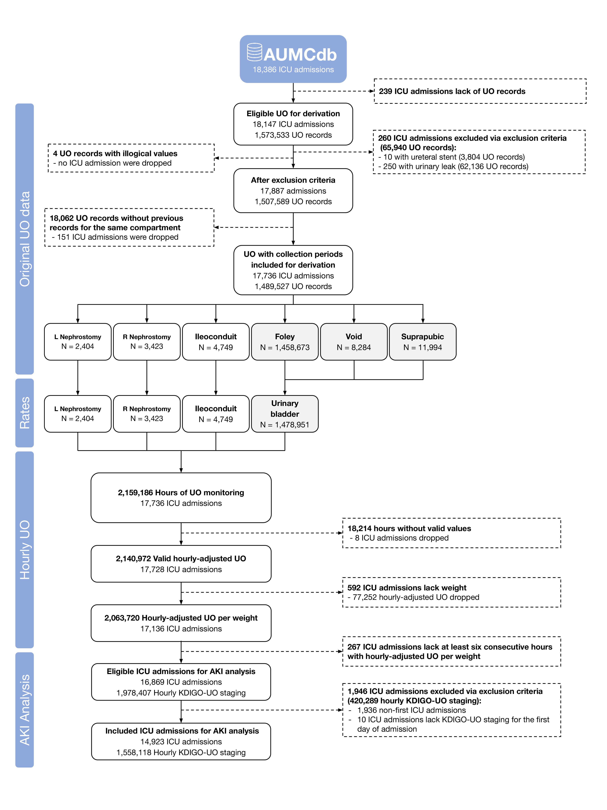

<!-- ################################ NOTICE ################################### -->
<!-- # 1. Running and creating the hourly-adjusted UO and AKI tables in the    # -->
<!-- #    associated billing account/project name is a preliminary requirement.# -->
<!-- #    For more information and instruction see the GitHub repository.      # -->
<!-- #                                                                         # -->
<!-- # 2. Please use 'Knit with Parameters' to provide your billing account    # -->
<!-- #    for Google's BigQuery.                                               # -->
<!-- ########################################################################### -->

```{r setup, include=FALSE}
knitr::opts_chunk$set(warning = FALSE, message = FALSE) 

# Installs pacman ("package manager") if needed
if (!require("pacman")) install.packages("pacman")

# Use pacman to load add-on packages as desired
pacman::p_load(pacman, DBI, bigrquery, tidyverse, reshape2, finalfit, psych, ggplot2, 
               ggbreak,scales,ggpmisc, ggforce, rlang, quantreg, broom, kableExtra, 
               rmdformats, survival, survminer, nortest, gtsummary,
               ggsci, ggsurvfit, gt, rms) 

# Establish connection with BigQuery and billing acount with the correct access
con <- dbConnect(
  bigrquery::bigquery(),
  project = "physionet-data",
  dataset = "mimiciv_icu",
  billing = params$billing_account
)

dbListTables(con)

add_by_n <- function(data, variable, by, ...) {
  data |> 
    select(all_of(c(variable, by))) |> 
    dplyr::arrange(pick(all_of(c(by, variable)))) |> 
    dplyr::group_by(.data[[by]]) |> 
    dplyr::summarise_all(~sum(!is.na(.))) %>%
    rlang::set_names(c("by", "variable")) %>%
    mutate(
      by_col = paste0("add_n_stat_", dplyr::row_number()),
      variable = style_number(variable)
    ) %>%
    select(-by) %>%
    tidyr::pivot_wider(names_from = by_col, 
                       values_from = variable)
}
```

```{r Quering BigQuery, cache=FALSE, include=FALSE}
raw_uo <- dbGetQuery(con, "SELECT * FROM `aumc_uo_and_aki.a_urine_output_raw`")

raw_uo_eligible <- dbGetQuery(con, statement = read_file('sql/raw eligible.sql'))

raw_uo_excluions_duplicates <- dbGetQuery(con, statement = read_file('sql/raw_uo_excluions_duplicates.sql'))

uo_rate_including_null_collection_period <- dbGetQuery(con, "SELECT * FROM `aumc_uo_and_aki.b_uo_rate`")
uo_rate <- uo_rate_including_null_collection_period %>%
  drop_na(TIME_INTERVAL)

hourly_uo <- dbGetQuery(con, "SELECT * FROM `aumc_uo_and_aki.c_hourly_uo`")
uo_ml_kg_hr <- hourly_uo %>% 
  drop_na(HOURLY_WEIGHTED_MEAN_RATE, WEIGHT_ADMIT) %>%
  mutate(ML_KG_HR = HOURLY_WEIGHTED_MEAN_RATE / WEIGHT_ADMIT)

kdigo_uo_stage <-
  dbGetQuery(con,
             "SELECT * FROM `aumc_uo_and_aki.d3_kdigo_stages` WHERE aki_stage_uo_cons IS NOT NULL")

table_1 <- dbGetQuery(con, statement = read_file('sql/tbl1.sql'))

akis_all_wide <- dbGetQuery(con, statement = read_file('sql/akis.sql')) %>%
  filter(FOLLOWUP_DAYS >= 0) %>%
  mutate(
    mortality_7 = if_else(DEATH_FLAG == 1 &
                            FOLLOWUP_DAYS < 8, 1, 0),
    mortality_30 = if_else(DEATH_FLAG == 1 &
                             FOLLOWUP_DAYS < 31, 1, 0),
    morality_90_days = if_else(FOLLOWUP_DAYS < 91 &
                                 DEATH_FLAG == 1, 1, 0)
  )

akis_all_long <- akis_all_wide %>%
  select(!FIRST_POSITIVE_STAGE_UO_CONS_TIME) %>%
  mutate(
    max_stage.newcons = MAX_STAGE_NEW_CONS,
    max_stage.newmean = MAX_STAGE_NEW_MEAN,
    first_stage.newcons = FIRST_STAGE_NEW_CONS,
    first_stage.newmean = FIRST_STAGE_NEW_MEAN,
    compartments.newcons = COMPARTMENT_COUNT,
    compartments.newmean = COMPARTMENT_COUNT,
    .keep = "unused"
  ) %>%
  pivot_longer(
    !c(
      STAY_ID,
      SUBJECT_ID,
      FOLLOWUP_DAYS,
      DEATH_FLAG,
      mortality_7,
      mortality_30,
      morality_90_days
    ),
    names_sep = "\\.",
    names_to = c(".value", "group")
  ) %>%
  mutate(
    prevalnce_admit = if_else(first_stage > 0, 1, 0),
    Incidence_first_72hr = case_when(first_stage > 0 ~ NA, max_stage == 0 ~ 0, max_stage > 0 ~ 1),
    Incidence_first_72hr_with_stage = ifelse(first_stage == 0 &
                                               max_stage > 0, max_stage, NA),
    .keep = "all"
  ) 
```
\ 

This is a full reproduction for the results of the validation cohort (AUMCdb).

\ 

### Citation

.............

.............

------------------------------------------------------------------------

# Population and Study's Sample

**Total I/M-CU stays in aumc:**

```{r}
print("Medium and intensive care:")
dbGetQuery(con, "SELECT count(*) FROM `original.admissions`")

print("Intensive care only:")
dbGetQuery(con, "SELECT count(*) FROM `original.admissions` WHERE lower(location) != 'mc'")
```

\

**ICU stays with UO records (eligible):**

```{r}
print("Raw UO per service type:")
table(raw_uo$SERVICE)

print("Total eligible ICU admissions:")
raw_uo %>% filter(SERVICE != "MC") %>%
  {n_distinct(.$STAY_ID)}
```

\

**Patients with UO records:**

```{r}
raw_uo %>% filter(SERVICE != "MC") %>%
  {n_distinct(.$SUBJECT_ID)}
```

\ 

**Count all UO records (before exclusions):**

```{r}
all_rows_count <- nrow(raw_uo %>% filter(SERVICE != "MC"))
all_rows_count
```

\ 


## Figure for Raw UO Records Data
Frequency of urine output charting by source
```{r}
bS3a <- raw_uo %>% 
  mutate(
    LABEL = case_when(
      LABEL == "GU Irrigant/Urine Volume Out" ~ "GU Irrig. Out",
      LABEL == "GU Irrigant Volume In" ~ "GU Irrig. In",
      .default = LABEL
    )
  ) %>% count(LABEL, sort = TRUE) %>%
   ggplot(aes(x=reorder(LABEL, -n), y=n)) +
   geom_bar(stat="identity") +
   xlab("") +
   ylab("") +
   geom_bar(stat="identity", fill="steelblue") +
   geom_text(aes(label=n), vjust=-0.6, color="black", size=3) +
   theme_classic() +
   theme(axis.text.y=element_blank()) +
   theme(axis.text.x = element_text(angle = 45, hjust = 1))

bS3a
```

\ 

## Check for Duplications

### Distinctiveness

First, we are basing distinctive rows in the raw UO data.

**Count distinct raw rows:**

```{r}
distinct_time_item_patient_rows_count <- raw_uo %>% 
  select(-VALUE, 
         -SERVICE, 
         -LABEL) %>% 
  n_distinct()

distinct_time_item_patient_rows_count
```

Conclusion: the original raw query does not have duplicates (all rows are distinct by all columns)

\ 

### Simultaneous Charting

```{r}
raw_uo_excluions_duplicates$same_value <- as.factor(raw_uo_excluions_duplicates$same_value)
raw_uo_excluions_duplicates$label <- as.factor(raw_uo_excluions_duplicates$label)
raw_uo_excluions_duplicates$label <- factor(raw_uo_excluions_duplicates$label, levels = as.factor(names(sort(table(raw_uo_excluions_duplicates$label),
                                  decreasing = TRUE))))

S1_a <- raw_uo_excluions_duplicates %>%
  select(same_value, label) %>%
  tbl_summary(by = same_value)

S1_a
```

|       Show full SQL query -----\>

```{sql, class.source = 'fold-hide', eval=FALSE, code = readLines("sql/raw_uo_excluions_duplicates.sql")}
```

In conclusion, most of the records have different values, and thus human error in duplicate record-keeping is not likely.

\ 

## Exclusion

**ICU type exclusion:**

```{r}
dbGetQuery(con, statement = read_file('sql/service_type_exclusion.sql'))
```

|       Show full SQL query -----\>

```{sql, class.source = 'fold-hide', eval=FALSE, code = readLines("sql/service_type_exclusion.sql")}
```

\ 

**Uretral stent exclusion:**

```{r}
dbGetQuery(con, statement = read_file('sql/ure_stent_exclusion.sql'))
```

|       Show full SQL query -----\>

```{sql, class.source = 'fold-hide', eval=FALSE, code = readLines("sql/ure_stent_exclusion.sql")}
```


\ 

**Urine incontinence exclusion:**

```{r}
dbGetQuery(con, statement = read_file('sql/Incontinence_exclusion.sql'))
```

|       Show full SQL query -----\>

```{sql, class.source = 'fold-hide', eval=FALSE, code = readLines("sql/Incontinence_exclusion.sql")}
```

\ 


**Not passing sanity check:**

```{r}
dbGetQuery(con, statement = read_file('sql/sanity.sql'))
```

|       Show full SQL query -----\>

```{sql, class.source = 'fold-hide', eval=FALSE, code = readLines("sql/sanity.sql")}
```

\ 

**Total raw urine output after exclusion ("eligible records, before collection time"):**

```{r}
nrow(raw_uo_eligible)
```

|       Show full SQL query -----\>

```{sql, class.source = 'fold-hide', eval=FALSE, code = readLines("sql/raw eligible.sql")}
```

\ 

**Total icu stays after exclusion ("eligible icu admissions, before collection time"):**

```{r}
n_distinct(raw_uo_eligible$STAY_ID)
```

**Exclusion of first volume in each compartment per ICU stay:**

```{r}
uo_rate_including_null_collection_period %>%
  filter(STAY_ID %in% raw_uo_eligible$STAY_ID) %>%
  filter(is.na(TIME_INTERVAL)) %>%
  nrow()
```

\ 

**UO records with time intervals:**

```{r}
uo_rate_including_null_collection_period %>%
  filter(STAY_ID %in% raw_uo_eligible$STAY_ID) %>%
  drop_na(TIME_INTERVAL) %>%
  nrow()
```

\

**Count UO records by anatomical compartment:**

```{r}
uo_rate %>% 
  mutate(agg_group = case_when(SOURCE == "Foley" |
                                 SOURCE == "Condom Cath" |
                                 SOURCE == "Straight Cath" |
                                 SOURCE == "Suprapubic" |
                                 SOURCE == "Void" ~ "Urinary bladder",
                               TRUE ~ SOURCE)
  ) %>%
           group_by(agg_group) %>%
   dplyr::summarise(N = n()
  )
```

\

**ICU stays with UO records with time intervals:**

```{r}
print("all ICU stays:")
uo_rate_including_null_collection_period %>%
  {n_distinct(.$STAY_ID)}

print("ICU stays with time intervals:")
uo_rate_including_null_collection_period %>%
                     drop_na(TIME_INTERVAL) %>%
  {n_distinct(.$STAY_ID)}

print("ICU stays with UO records that does not  have time interval (no previous UO record in the same compartment:")
uo_rate_including_null_collection_period %>%
                     filter(is.na(TIME_INTERVAL)) %>%
  {n_distinct(.$STAY_ID)}

print("ICU stays dropped due to no UO records with time intervalst (no previous UO record in the same compartment:")
(uo_rate_including_null_collection_period %>%
                     filter(is.na(TIME_INTERVAL))) %>%
  filter(!(STAY_ID %in% (uo_rate_including_null_collection_period %>%
                     drop_na(TIME_INTERVAL))$STAY_ID)) %>%
  {n_distinct(.$STAY_ID)}
```

\

**Count total ICU days of UO monitoring for icu stays with time intervals:**

```{r}
hourly_uo %>%
  filter(STAY_ID %in%
           (uo_rate_including_null_collection_period %>%
                     drop_na(TIME_INTERVAL))$STAY_ID) %>%
  nrow() / 24
```

\

**Hours of UO monitoring:**

```{r}
print("Eligible hours of UO monitoring:")
hourly_uo %>%
  filter(STAY_ID %in% raw_uo_eligible$STAY_ID) %>%
  nrow()

print("Valid hourly-adjusted UO monitoring hours:")
hourly_uo %>%
  filter(STAY_ID %in% raw_uo_eligible$STAY_ID) %>%
  drop_na(HOURLY_WEIGHTED_MEAN_RATE) %>%
  nrow()

print("ICU stays with valid hourly-adjusted UO monitoring hours:")
hourly_uo %>%
  filter(STAY_ID %in% raw_uo_eligible$STAY_ID) %>%
  drop_na(HOURLY_WEIGHTED_MEAN_RATE) %>%
  {n_distinct(.$STAY_ID)}
```

\

**Proportion of valid hours covered out of included hours of uo monitoring:**

```{r}
hourly_uo %>%
  filter(STAY_ID %in% raw_uo_eligible$STAY_ID) %>%
  drop_na(HOURLY_WEIGHTED_MEAN_RATE) %>%
  nrow() / hourly_uo %>%
  filter(STAY_ID %in% raw_uo_eligible$STAY_ID) %>%
  nrow()
```

\ 

**Hourly-adjusted UO with admission weights:**

```{r}
print("ICU stays with admission weight and valid hourly-adjusted UO:")
hourly_uo %>%
  filter(STAY_ID %in% raw_uo_eligible$STAY_ID) %>%
  drop_na(HOURLY_WEIGHTED_MEAN_RATE, WEIGHT_ADMIT) %>%
  {n_distinct(.$STAY_ID)}

print("Valid hourly-adjusted UO monitoring hours with admission weights:")
hourly_uo %>%
  filter(STAY_ID %in% raw_uo_eligible$STAY_ID) %>%
  drop_na(HOURLY_WEIGHTED_MEAN_RATE, WEIGHT_ADMIT) %>%
  nrow()
```
\

**ICU stays with calculated KDIGO-UO staging (at least six consecutive hours with valid charting of hourly-adjusted UO)**

```{r}
print("number of ICU stays with valid KDIGO-UO staging")
kdigo_uo_stage %>% 
  filter(stay_id %in% raw_uo_eligible$STAY_ID) %>%
  {n_distinct(.$stay_id)}

print("number of included hours with valid KDIGO-UO staging")
kdigo_uo_stage %>% 
  filter(stay_id %in% raw_uo_eligible$STAY_ID) %>%
  nrow()
```
\

**eligible first ICU admission to each patient for AKI analysis**

```{r}
first_icu_stay <-
  dbGetQuery(
    con,
    "SELECT patientid, admissionid FIRST_STAY_ID_IN_PATIENT FROM `original.admissions`
where admissioncount = 1"
  )

print("number of first ICU stays with valid KDIGO-UO staging")
kdigo_uo_stage %>% 
  filter(stay_id %in% first_icu_stay$FIRST_STAY_ID_IN_PATIENT
         & stay_id %in% raw_uo_eligible$STAY_ID) %>%
  {n_distinct(.$stay_id)}

print("number of valid hourly KDIGO-UO staging in first ICU stays")
kdigo_uo_stage %>% 
  filter(stay_id %in% first_icu_stay$FIRST_STAY_ID_IN_PATIENT
         & stay_id %in% raw_uo_eligible$STAY_ID) %>%
  nrow()
```

\

**included ICU admissions for AKI analysis**
```{r}
print("number of first ICU stays (after exclusion criteria) with valid KDIGO-UO staging for the first 24-hours ins ICU stay")

aki_epi <- akis_all_long %>%
  filter(group == "newcons") %>%
  drop_na(prevalnce_admit) %>%
  transmute(STAY_ID,
           first_kdigo_uo = first_stage,
         max_uo_stage = max_stage)
  
kdigo_uo_stage %>% 
  filter(stay_id %in% aki_epi$STAY_ID) %>%
  {n_distinct(.$stay_id)}

print("number of valid hourly KDIGO-UO for those stays")
kdigo_uo_stage %>% 
  filter(stay_id %in% aki_epi$STAY_ID) %>%
  nrow()
```

\ 

## Inclusion/Exclusion Flowchart 

```{r}

```

## Table 1 - Patient's characteristics

```{r}
table_1$SERVICE <- as.factor(table_1$SERVICE)
table_1$admission_age <- as.numeric(table_1$admission_age)
table_1$weight_admit <- as.numeric(table_1$weight_admit)
table_1$height_first <- as.numeric(table_1$height_first)
table_1$creat_peak_72 <- as.numeric(table_1$creat_peak_72)
table_1$creat_peak_72 <- as.numeric(table_1$creat_peak_72)
table_1$creat_last <- as.numeric(table_1$creat_last)

uo_for_table1 <- uo_rate_including_null_collection_period %>%
  drop_na(TIME_INTERVAL) %>%
  group_by(STAY_ID) %>%
  summarise(
    count = n(),
    volumes = mean(VALUE, na.rm = TRUE),
    collection_times = mean(TIME_INTERVAL, na.rm = TRUE),
    rates = mean(HOURLY_RATE, na.rm = TRUE),
    ml_kg_hr = mean(HOURLY_RATE / WEIGHT_ADMIT, na.rm = TRUE)
  )

t1a <- table_1 %>%
  select(
    admission_age,
    gender,
    weight_admit,
    creat_first,
    creat_peak_72,
    creat_last,
    icu_days,
    rrt_binary,
    hospital_expire_flag
  ) %>%
  tbl_summary(
    type = list(
      c(hospital_expire_flag,
        rrt_binary) ~ "dichotomous",
      c(admission_age,
        weight_admit,
        creat_peak_72,
        creat_first,
        creat_last) ~ "continuous"
    ),
    statistic = c(admission_age,
                  weight_admit,
                  creat_first,
                  creat_peak_72,
                  creat_last) ~ "{mean} ({sd})",
    digits = list(icu_days ~ 1),
    missing = "no",
    label = list(
      admission_age ~ "Age at Hospital Admission, years",
      gender ~ "Gender",
      creat_first ~ "First Creatinine in ICU, mg/dL",
      creat_peak_72 ~ "Peak Creatinine at first days, mg/dL",
      creat_last ~ "Hospital Discharge Creatinine, mg/dL",
      weight_admit ~ "Weight at ICU Admission, kg",
      icu_days ~ "Time in ICU, days",
      rrt_binary ~ "Renal replacement therapy",
      hospital_expire_flag ~ "Hospital Mortality"
    )
  ) %>%
  add_n() 

display_prec <- function(x)
  mean(x) * 100

t1b <- uo_for_table1 %>%
  select(count,
         volumes,
         collection_times,
         rates,
         ml_kg_hr) %>%
  tbl_summary(
    type = list(
      c(volumes,
        collection_times,
        rates,
        ml_kg_hr) ~ "continuous"
    ),
    statistic = list(
      c(volumes,
        collection_times,
        rates,
        ml_kg_hr) ~ "{mean} ({sd})"
    ),
    missing = "no",
    label = list(
      count ~ "Number of Measurements",
      volumes ~ "Average Volumes, mL",
      collection_times ~ "Average Collection Times, minutes",
      rates ~ "Average Rates, mL/hr",
      ml_kg_hr ~ "Average Rate to Weight, mL/hr/kg"
    )
  ) %>%
  add_n() 

tbl_stack(
  list(t1a, t1b),
  group_header = c("ICU Stay", "UO Charting Across ICU Stay")
) %>%
  as_gt() %>%
  tab_source_note(source_note = "The variables age at hospital admission, gender, CCI, CKD, ethnicity, time in hospital, and mortality are measured for each hospital admission and might be counted for more than one ICU stay. All other variables are measured individually for each ICU stay. The variables average collection times, average rates, and average rate to weight are only presented for ICU stays with at least two UO measurements for the same compartment, and the latter also required weight at admission. AKI variables were presented for ICU stays with at least one hour with a non-null KDIGO-UO stage. The variables average AKI duration and total time in AKI were specifically reported for ICU stays with at least one AKI event.") %>%
  tab_source_note(source_note = "AKI: Acute Kidney Injury; CCI: Charlson Comorbidity Index; CKD Stage 1-4: Chronic Kidney Disease excluding end-stage-renal-disease; ICU: Intensive Care Unit; KDIGO: Kidney Disease: Improving Global Outcomes; SOFA: Sequential Organ Failure Assessment; UO: Urine Output.")
```

\ 

## Table 2 - UO records characteristics

```{r}
uo_rate$SOURCE <- as.factor(uo_rate$SOURCE)
uo_rate$SERVICE <- as.factor(uo_rate$SERVICE)

uo_rate %>%
  select(VALUE, TIME_INTERVAL, SOURCE, SERVICE) %>%
  tbl_summary(by=SERVICE) %>%
  add_overall()
```


------------------------------------------------------------------------

# Raw data analysis

## Collection Periods

```{r}
bS6_a <- uo_rate %>% group_by(SOURCE) %>%
   dplyr::summarise(N = n(),
                   Mean = round(mean(TIME_INTERVAL),0),
                   SD = round(sd(TIME_INTERVAL),0),
                   '5th' = round(quantile(TIME_INTERVAL, 0.05),0),
                   '10th' = round(quantile(TIME_INTERVAL, 0.1),0),
                   '25th' = round(quantile(TIME_INTERVAL, 0.25),0),
                   '50th' = round(quantile(TIME_INTERVAL, 0.50),0),
                   '75th' = round(quantile(TIME_INTERVAL, 0.75),0),
                   '95th' = round(quantile(TIME_INTERVAL, 0.95),0),
                   Min = round(min(TIME_INTERVAL),0),
                   Max = round(max(TIME_INTERVAL),0)
  ) %>% 
  arrange(desc(N)) %>% 
  gt() %>%
  fmt_number(use_seps = TRUE, decimals = 0)

bS6_a
```


```{r}
bS6_b <- ggplot(data = uo_rate, aes(x = TIME_INTERVAL / 60)) +
  geom_histogram(binwidth = 1) +
  facet_wrap(~factor(SOURCE, levels=c('Foley', 'Suprapubic', 'Ileoconduit',
                         'Void',
                         'R Nephrostomy', 'L Nephrostomy')), scales = "free") +
  xlim(-1, 20) +
  labs(
          x = "Time interval (hr)",
          y = "Frequency"
        )

bS6_b
```

\ 

## Volumes and Collection Periods

```{r}
bS7_a <- uo_rate %>% group_by(SOURCE) %>%
  dplyr::summarise(N = n(),
                   Mean = round(mean(VALUE),0),
                   SD = round(sd(VALUE),0),
                   '5th' = round(quantile(VALUE, 0.05),0),
                   '10th' = round(quantile(VALUE, 0.1),0),
                   '25th' = round(quantile(VALUE, 0.25),0),
                   '50th' = round(quantile(VALUE, 0.50),0),
                   '75th' = round(quantile(VALUE, 0.75),0),
                   '95th' = round(quantile(VALUE, 0.95),0),
                   Min = round(min(VALUE),0),
                   Max = round(max(VALUE),0)
  ) %>% 
  arrange(desc(N)) %>% 
  gt() %>%
  fmt_number(use_seps = TRUE, decimals = 0)

bS7_a
```

```{r}
bS7_b <- ggplot(data = uo_rate, aes(x = VALUE)) +
  facet_wrap(~factor(SOURCE, levels=c('Foley', 'Suprapubic', 'Ileoconduit',
                         'Void',
                         'R Nephrostomy', 'L Nephrostomy')), scales = "free") +  geom_histogram(binwidth = 50) +
  xlim(-25, 1100) +
  labs(
        # title = "Volumes",
        x = "Volume (ml)",
        y = "Frequency"
      ) +
      theme(
        plot.title = element_text(color = "#0099F8", size = 16, face = "bold"),
        plot.subtitle = element_text(size = 10, face = "bold"),
        plot.caption = element_text(face = "italic")
      )

bS7_b
```

\ 

### Records of zero volume

**The proportion of zero value UO measurements:**

```{r}
uo_rate_count <- uo_rate %>% 
  count(SOURCE, sort = TRUE)

uo_rate_0_count <- uo_rate %>% 
  filter(VALUE == 0) %>% 
  count(SOURCE, sort = TRUE)

count_uo_zero_vs_all <- left_join(uo_rate_count, 
                                  uo_rate_0_count, by = "SOURCE") %>% 
  mutate(PROPORTION = n.y / n.x) %>%
  pivot_longer(cols = n.y:n.x, names_to = "type")
  
bS7_c <- count_uo_zero_vs_all %>%
  ggplot(aes(x=reorder(SOURCE, -value), y=value, fill=type)) +
    geom_bar(position="fill", stat="identity") +
    xlab("") +
    ylab("") +
    scale_fill_brewer(palette="Paired") +  
    geom_text(aes(label=ifelse(type == "n.y", paste0((round(PROPORTION, 3) * 100), "%"), "")), 
          color="black", 
          size=3, 
          vjust=-1,
          position="fill") +
    theme_minimal() +
    theme(axis.text.y=element_blank()) +
    theme(legend.position="none") +
  theme(axis.text.y=element_blank()) +
  theme(axis.text.x = element_text(angle = 45, hjust = 1))+
     labs(
         # title = "Proportion of zero value raw output count",
       )
bS7_c
```

```{r}
uo_rate_0 <- uo_rate %>% filter(VALUE == 0) 
bS7_d <- uo_rate_0 %>% group_by(SOURCE) %>%
  dplyr::summarise(N = n(),
                   Mean = round(mean(TIME_INTERVAL),0),
                   SD = round(sd(TIME_INTERVAL),0),
                   '5th' = round(quantile(TIME_INTERVAL, 0.05),0),
                   '10th' = round(quantile(TIME_INTERVAL, 0.1),0),
                   '25th' = round(quantile(TIME_INTERVAL, 0.25),0),
                   '50th' = round(quantile(TIME_INTERVAL, 0.50),0),
                   '75th' = round(quantile(TIME_INTERVAL, 0.75),0),
                   '95th' = round(quantile(TIME_INTERVAL, 0.95),0),
                   Min = round(min(TIME_INTERVAL),0),
                   Max = round(max(TIME_INTERVAL),0)
  ) %>% 
  arrange(desc(N)) %>% 
  gt() %>%
  fmt_number(use_seps = TRUE, decimals = 0)

bS7_d
```

------------------------------------------------------------------------

# Adjusting for hourly UO

## UO Rate

```{r}
bS8_a <- uo_rate %>% group_by(SOURCE) %>%
    dplyr::summarise(N = n(),
                   Mean = round(mean(HOURLY_RATE),0),
                   SD = round(sd(HOURLY_RATE),0),
                   '5th' = round(quantile(HOURLY_RATE, 0.05),0),
                   '10th' = round(quantile(HOURLY_RATE, 0.1),0),
                   '25th' = round(quantile(HOURLY_RATE, 0.25),0),
                   '50th' = round(quantile(HOURLY_RATE, 0.50),0),
                   '75th' = round(quantile(HOURLY_RATE, 0.75),0),
                   '95th' = round(quantile(HOURLY_RATE, 0.95),0),
                   Min = round(min(HOURLY_RATE),0),
                   Max = round(max(HOURLY_RATE),0)
  ) %>% 
  arrange(desc(N)) %>% 
  gt() %>%
  fmt_number(use_seps = TRUE, decimals = 0)

bS8_a
```

```{r}
bS8_b <- ggplot(data = uo_rate, aes(x = HOURLY_RATE)) +
  geom_histogram(binwidth = 20) +
  facet_wrap(~factor(SOURCE, levels=c('Foley', 'Suprapubic', 'Ileoconduit',
                         'Void',
                         'R Nephrostomy', 'L Nephrostomy')), scales = "free") +  xlim(-10, 500) +
  labs(
        # title = "UO Rates",
        # subtitle = "by source",
        x = "Rate (ml/hr)",
        y = "Frequency"
      ) +
      theme(
        plot.title = element_text(color = "#0099F8", size = 16, face = "bold"),
        plot.subtitle = element_text(size = 10, face = "bold"),
        plot.caption = element_text(face = "italic")
      )

bS8_b
```

\ 

### Low UO Rate Analysis
The association between UO rates and collection periods, smoothed conditional means for records of Foley catheter.

```{r}
bS8_d <- uo_rate %>%
  filter(SOURCE == "Foley",
         HOURLY_RATE < 500) %>%
  # slice_head(n = 50000) %>%
  ggplot(aes(x = HOURLY_RATE, y = TIME_INTERVAL)) +
  geom_smooth(se = TRUE, alpha = 0.1, linewidth = 1) +
  # geom_smooth(
  #   se = FALSE,
  #   method = "lm",
  #   linetype = "dashed",
  #   color = "red", 
  #   linewidth = 0.3
  # ) +
  geom_hline(yintercept = 60,
             size = 0.3,
             color = "#cccccc") +
  geom_vline(
    xintercept = 20,
    size = 0.3,
    color = "black",
    linetype = "dotdash"
  ) +
  scale_x_continuous(breaks = c(0, 20, 50, 100, 200, 300, 400, 500)) +
  scale_y_continuous(breaks = c(0, 60, 100, 200)) +
  coord_cartesian(xlim = c(0, 500), ylim = c(0, 200)) +
  labs(x = "Urine output rate (ml/hr)", y = "Collection periods (min)") +
  theme_classic()

bS8_d
```

Quantile analysis for collection periods as a function of rates.

```{r, cache=TRUE}
uo_rate_qreg <- uo_rate %>%
  filter(SOURCE == "Foley",
         HOURLY_RATE < 500) %>%
  arrange(desc(CHARTTIME)) %>%
  slice_head(n = 500000)

# #### Quantile
quantile_reg <- rq(TIME_INTERVAL ~
                     HOURLY_RATE,
                   seq(0.10, 0.90, by = 0.10),
                   # c(.05, .1, .25, .5, .75, .90, .95),
                   data = uo_rate_qreg)

# summary(quantile_reg, se = "iid") %>% 
#   plot()
```

```{r, eval=TRUE}
### OLS
lm <- lm(data=uo_rate_qreg,
         formula =  TIME_INTERVAL ~
           HOURLY_RATE)

ols <- as.data.frame(coef(lm))
ols.ci <- as.data.frame(confint(lm, level = 0.95))
ols2 <- cbind(ols, ols.ci)
ols2 <- tibble::rownames_to_column(ols2, var="term")


#### Quantile
bS8_e <- quantile_reg %>%
  tidy(se.type = "iid", conf.int = TRUE, conf.level = 0.95) %>%
  filter(!grepl("factor", term)) %>%
  ggplot(aes(x=tau,y=estimate)) +
  theme_classic() +
  theme(
    strip.background = element_blank(),
    #strip.text.x = element_blank()
  ) +
  scale_y_continuous(limits = symmetric_limits) +
  scale_x_continuous(breaks = scales::pretty_breaks(n = 12)) +
  ##### quantilie results
  geom_point(color="#27408b", size = 0.3)+ 
  geom_line(color="black", linetype = "dotdash", size = 0.3)+ 
  geom_ribbon(aes(ymin=conf.low,ymax=conf.high),alpha=0.25, fill="#555555")+
  facet_wrap(~term, scales="free", ncol=1)+
  ##### OLS results
  geom_hline(data = ols2, aes(yintercept= `coef(lm)`), lty=1, color="red", size=0.3)+
  geom_hline(data = ols2, aes(yintercept= `2.5 %`), lty=2, color="red", size=0.3)+
  geom_hline(data = ols2, aes(yintercept= `97.5 %`), lty=2, color="red", size=0.3)+
  #### Lines
   geom_hline(yintercept = 0, size=0.3) 

bS8_e
```

```{r}
# Visualization for Quantile Regression with some tau values: 
intercept_slope <- quantile_reg %>% 
  coef() %>% 
  t() %>% 
  data.frame() %>% 
  rename(intercept = X.Intercept., slope = HOURLY_RATE) %>% 
  mutate(quantile = row.names(.))


bS8_f <-
  ggplot() +
  geom_point(data = uo_rate_qreg, aes(HOURLY_RATE, TIME_INTERVAL),
    alpha = 0.2,
    size = 0.5,
    stroke = 0.5,
    width = 2,
    height = 2
  ) +
  geom_abline(data = intercept_slope, aes(
    intercept = intercept,
    slope = slope,
    color = quantile
  ),
  linewidth=1) +
  theme_minimal() +
  labs(x = "Urine output rate (ml/hr)", y = "Collection periods (min)") +
  coord_cartesian(xlim = c(0, 500), ylim = c(0, 500)) +
  theme(legend.position="bottom")

bS8_f
```

\ 

**Collection periods for UO rate 20ml/hr or below**

```{r}
uo_rate %>% 
  filter(HOURLY_RATE <= 20) %>%
  group_by(SOURCE) %>%
   dplyr::summarise(N = n(),
                   Mean = round(mean(TIME_INTERVAL),0),
                   SD = round(sd(TIME_INTERVAL),0),
                   '5th' = round(quantile(TIME_INTERVAL, 0.05),0),
                   '10th' = round(quantile(TIME_INTERVAL, 0.1),0),
                   '25th' = round(quantile(TIME_INTERVAL, 0.25),0),
                   '50th' = round(quantile(TIME_INTERVAL, 0.50),0),
                   '75th' = round(quantile(TIME_INTERVAL, 0.75),0),
                   '95th' = round(quantile(TIME_INTERVAL, 0.95),0),
                   Min = round(min(TIME_INTERVAL),0),
                   Max = round(max(TIME_INTERVAL),0)
  ) %>% 
  arrange(desc(N)) %>% 
  gt() %>%
  fmt_number(use_seps = TRUE, decimals = 0)
```

```{r}
uo_rate %>% 
  filter(HOURLY_RATE <= 20) %>%
ggplot(aes(x = TIME_INTERVAL / 60)) +
  geom_histogram(binwidth = 1) +
  facet_wrap(~factor(SOURCE, levels=c('Foley', 'Suprapubic', 'Ileoconduit',
                         'Void',
                         'R Nephrostomy', 'L Nephrostomy')), scales = "free") +  xlim(-1, 20) +
  labs(
          title = "Collection periods for UO rate 20ml/hr or below",
          subtitle = "by source",
          x = "Time interval (hr)",
          y = "Frequency"
        ) +
        theme(
          plot.title = element_text(color = "#0099F8", size = 16, face = "bold"),
          plot.subtitle = element_text(size = 10, face = "bold"),
          plot.caption = element_text(face = "italic")
        )
```

\ 

### Mean Rate
**Mean UO rate weighted by tyme and grouped by source:**
```{r}
bS8_c <- uo_rate %>% 
  group_by(SOURCE) %>%
  summarise(weighted_mean_rate = weighted.mean(HOURLY_RATE, TIME_INTERVAL)) %>%
  gt() %>%
  fmt_number(use_seps = TRUE, decimals = 1) %>%
  cols_label(
    SOURCE = "Source",
    weighted_mean_rate = "Weighted mean rate (ml/hr)"
  )

bS8_c
```

\ 

## Hourly-adjusted UO

```{r}
# 2065999
bS9_a <- hourly_uo %>% drop_na(HOURLY_WEIGHTED_MEAN_RATE) %>%
    dplyr::summarise(N = n(),
                   Mean = round(mean(HOURLY_WEIGHTED_MEAN_RATE),0),
                   SD = round(sd(HOURLY_WEIGHTED_MEAN_RATE),0),
                   '5th' = round(quantile(HOURLY_WEIGHTED_MEAN_RATE, 0.05),0),
                   '10th' = round(quantile(HOURLY_WEIGHTED_MEAN_RATE, 0.1),0),
                   '25th' = round(quantile(HOURLY_WEIGHTED_MEAN_RATE, 0.25),0),
                   '50th' = round(quantile(HOURLY_WEIGHTED_MEAN_RATE, 0.50),0),
                   '75th' = round(quantile(HOURLY_WEIGHTED_MEAN_RATE, 0.75),0),
                   '95th' = round(quantile(HOURLY_WEIGHTED_MEAN_RATE, 0.95),0),
                   Min = round(min(HOURLY_WEIGHTED_MEAN_RATE),0),
                   Max = round(max(HOURLY_WEIGHTED_MEAN_RATE),0)
  ) %>% 
  arrange(desc(N)) %>% 
  gt() %>%
  fmt_number(use_seps = TRUE, decimals = 0)

bS9_a
```

```{r}
bS9_b <- hourly_uo %>% drop_na(HOURLY_WEIGHTED_MEAN_RATE) %>%
ggplot(aes(x = HOURLY_WEIGHTED_MEAN_RATE)) +
  geom_histogram(binwidth = 25) +
  xlim(-10, 500) + 
  labs(
        # title = "Hourly-Adjusted UO",
        x = "Hourly UO (ml)",
        y = "Frequency"
      )

bS9_b
```

\ 

### Simple Sum Comparison
**Showing proportion of hours with less than  100ml difference):**

```{r}
adj_uo_diff <- hourly_uo %>%
  select(HOURLY_WEIGHTED_MEAN_RATE, SIMPLE_SUM) %>%
  filter(!is.na(HOURLY_WEIGHTED_MEAN_RATE)) %>%
  mutate(hourly_diff = abs(HOURLY_WEIGHTED_MEAN_RATE - SIMPLE_SUM)) %>%
  mutate(
    cutoff_10 = if_else(hourly_diff < 10, 1, 0),
    cutoff_50 = if_else(hourly_diff < 50, 1, 0),
    cutoff_100 = if_else(hourly_diff < 100, 1, 0),
    cutoff_150 = if_else(hourly_diff < 150, 1, 0),
    cutoff_200 = if_else(hourly_diff < 200, 1, 0)
  )

my_order <- c("<10", "<50", "<100", "<150", "<200")

bS11 <- adj_uo_diff %>%
  select(cutoff_10,
         cutoff_50,
         cutoff_100,
         cutoff_150,
         cutoff_200) %>%
  pivot_longer(cols = contains("cutoff")) %>%
  transmute(name = case_when(
    name == "cutoff_10" ~ "<10",
    name == "cutoff_50" ~ "<50",
    name == "cutoff_100" ~ "<100",
    name == "cutoff_150" ~ "<150",
    name == "cutoff_200" ~ "<200"
  ),
  value) %>%
  group_by(name) %>%
  summarise(agreement = paste0(round(mean(value) * 100, 1), "%"),
            non_agreement = paste0(round((1 - mean(
              value
            )) * 100, 1), "%")) %>%
  arrange(match(name, my_order)) %>%
  gt() %>%
  # tab_header(
  #   title = md("**Comparison of Hourly-Adjusted UO and Simple Summation**"),
  # ) %>%
  cols_label(
    name = "Cut-off (ml)",
    agreement = "Proportion  of Agreement",
    non_agreement = "Proportion  of Disagreement"
  ) %>%
  cols_align(
    align = "center"
  ) %>%
  tab_source_note(source_note = "The table demonstrates the significance of hourly adjustment for accuracy by presenting the variance between the adjusted values and the simple hourly summation. Cut-off values are based on the absolute difference between the hourly-adjusted UO and a simple hourly summation of UO. Measurements charted on the hour were included with the previous time interval. ")

adj_uo_diff <- hourly_uo %>%
  select(HOURLY_WEIGHTED_MEAN_RATE, SIMPLE_SUM) %>%
  filter(!is.na(HOURLY_WEIGHTED_MEAN_RATE)) %>%
  mutate(no_diff = 
           ifelse((is.na(HOURLY_WEIGHTED_MEAN_RATE) &
                  is.na(SIMPLE_SUM)) |
             (!is.na(HOURLY_WEIGHTED_MEAN_RATE) &
                  !is.na(SIMPLE_SUM) &
                    abs(HOURLY_WEIGHTED_MEAN_RATE-SIMPLE_SUM) < 100), 
                  1, 
                  0),
         .keep = "none")

bS11

mean(adj_uo_diff$no_diff)
```

\ 

### Hourly UO Per Kilogram

```{r}
# 1993167
bS9_c <- uo_ml_kg_hr %>%
  dplyr::summarise(N = n(),
                   Mean = round(mean(ML_KG_HR),2),
                   SD = round(sd(ML_KG_HR),2),
                   '5th' = round(quantile(ML_KG_HR, 0.05),2),
                   '10th' = round(quantile(ML_KG_HR, 0.1),2),
                   '25th' = round(quantile(ML_KG_HR, 0.25),2),
                   '50th' = round(quantile(ML_KG_HR, 0.50),2),
                   '75th' = round(quantile(ML_KG_HR, 0.75),2),
                   '95th' = round(quantile(ML_KG_HR, 0.95),2),
                   Min = round(min(ML_KG_HR),2),
                   Max = round(max(ML_KG_HR),2)
  ) %>% gt() %>%
  fmt_number(use_seps = TRUE, decimals = 2)

bS9_c
```

```{r}
mean_log <- log(mean(uo_ml_kg_hr$ML_KG_HR))
sd_log <- log(sd(uo_ml_kg_hr$ML_KG_HR))
bS9_d <- ggplot() + 
  xlim(0, 2) + 
  geom_histogram(aes(x = ML_KG_HR
                     # , y =..density..
                     ), data=uo_ml_kg_hr, binwidth = 0.02) + 
  # stat_function(fun = dlnorm, args = list(meanlog = mean_log, sdlog = sd_log, log = FALSE), size=1, color='gray') +
  labs(
        # title = "Hourly-Adjusted UO per Kilogram",
        x = "Hourly volume to kg (ml/hr/kg)",
        y = "Frequency"
      )

bS9_d
```

# KDIGO Criteria Avarage-UO, Consecutive-UO and Old (MIMIC repo official deriviation) Compariton

```{r}
aumc_kdigo_inter_aki_table <- akis_all_long %>%
  filter(group != "old") %>%
  drop_na(prevalnce_admit) %>%
  transmute(
    group = case_when(
      group == "newcons" ~ 'UO-Consecutive',
      group == "newmean" ~ 'UO-Average',
      group == "old" ~ 'Block summation'
    ),
    aki_binary = if_else(max_stage > 0, 1, 0),
    max_stage = if_else(max_stage == 0, NA, max_stage),
    prevalnce_admit
  ) %>%
  tbl_summary(
    by = "group",
    missing = "no",
    digits = everything() ~ c(0, 1),
    label = list(
      aki_binary ~ "Oliguric-AKI on the first days",
      prevalnce_admit ~ "Prevalence at admission",
      max_stage ~ "Maximum KDIGO staging"
    )
  )  %>%
  modify_column_indent(columns = label, rows = c(FALSE, TRUE)) %>%
  modify_column_indent(
    columns = label,
    rows = c(FALSE, FALSE, TRUE, TRUE, TRUE),
    double_indent = TRUE
  ) %>%
  add_p()

aumc_kdigo_inter_aki_table
```


```{r}
aumc_kdigo_inter_cons_mean <- akis_all_long %>%
  transmute(STAY_ID,
            group,
            first_stage,
            max_stage,
            aki_above_2 = max_stage > 1) %>%
  filter(aki_above_2 == TRUE,
         (group != "old")) %>%
  mutate(group = case_when(
    group == "newcons" ~ 'UO-Consecutive',
    group == "newmean" ~ 'UO-Average',
    group == "old" ~ 'Block summation'
  )) %>%
  left_join(table_1, by = "STAY_ID") %>%
  select(
    group,
    admission_age,
    weight_admit,
    gender,
    creat_first,
    creat_last,
  # scr_baseline,
    icu_days,
    rrt_binary,
    hospital_expire_flag
  ) %>%
  tbl_summary(
    by = group,
    type = list(
      c(rrt_binary) ~ "dichotomous",
      c(admission_age,
        weight_admit,
        creat_first,
        creat_last) ~ "continuous"
    ),
    statistic = c(admission_age,
                  weight_admit,
                  creat_first,
                  creat_last) ~ "{mean} ({sd})",
    missing = "no",
    label = list(
      admission_age ~ "Age at Hospital Admission, years",
      gender ~ "Gender",
      weight_admit ~ "Weight at ICU Admission, kg",
      creat_first ~ "First Creatinine, mg/dL",
      creat_last ~ "Hospital Discharge Creatinine, mg/dL",
      icu_days ~ "Time in ICU, days",
      rrt_binary ~ "Renal replacement therapy",
      hospital_expire_flag ~ "Hospital Mortality"
    )
  ) %>%
  add_p() %>%
  add_stat(
    fns = everything() ~ add_by_n
  ) %>%
  modify_header(starts_with("add_n_stat") ~ "**N**") %>%
  modify_table_body(
    ~ .x %>%
      dplyr::relocate(add_n_stat_1, .before = stat_1) %>%
      dplyr::relocate(add_n_stat_2, .before = stat_2)
  )

aumc_kdigo_inter_cons_mean
```

```{r}
akis_all_long %>%
  group_by(group, max_stage) %>%
  summarise(Propo = sum(mortality_7, na.rm = T) / n()) %>%
  ggplot(aes(max_stage, Propo, fill = group)) + geom_col(position = 'dodge')


aumc_cdplod_mean <- cdplot(as.factor(mortality_7)~max_stage, (akis_all_long %>% 
                                        filter(group == "newmean")),
       col=c("lightgoldenrod", "lightcyan"), 
       ylab = "7 days mortality", xlab ="Max KDIGO-UO stage", main = "CD Plot for UOmean")
aumc_cdplod_mean

aumc_cdplod_cons <- cdplot(as.factor(mortality_7)~max_stage, (akis_all_long %>% 
                                        filter(group == "newcons")),
       col=c("lightgoldenrod", "lightcyan"), 
       ylab = "7 days mortality", xlab ="Max KDIGO-UO stage", main = "CD Plot for UOcons")
aumc_cdplod_cons


model_mean <- glm(
  mortality_7 ~ MAX_STAGE_NEW_MEAN + FIRST_STAGE_NEW_MEAN,
  data = akis_all_wide,
  family = binomial
)

model_cons <- glm(
  mortality_7 ~ MAX_STAGE_NEW_CONS + FIRST_STAGE_NEW_CONS,
  data = akis_all_wide,
  family = binomial
)

# anova(model_old, model_new, test = 'Chisq')
aumc_kdigo_inter_bic <- BIC(model_mean, model_cons)

aumc_kdigo_inter_bic <- cbind(Model = rownames(aumc_kdigo_inter_bic), aumc_kdigo_inter_bic) %>%
  gt()

aumc_kdigo_inter_bic
```

```{r}
# descriptive
descriptive_tbl <- akis_all_long %>%
  group_by(group, max_stage) %>%
  summarise(
    n = n(),
    dead = sum(DEATH_FLAG),
    mortality_prop = sum(DEATH_FLAG) / n()
  ) %>%
  # drop_na() %>%
  group_by(group) %>%
  transmute(
    max_stage,
    "Patients, No. (%)" = paste0(n, " (", round((n / sum(
      n
    )), 2), ")"),
    "Mortality, No. (%)" = paste0(dead, " (", round(mortality_prop, 2), ")")
  ) %>%
  gt()

# glm
m1 <- glm(
  DEATH_FLAG ~ stage_newcons,
  family = binomial,
  data = (
    akis_all_long %>%
      filter(group == "newcons") %>%
      mutate(stage_newcons = as.factor(max_stage))
  )
)

m2 <- glm(
  DEATH_FLAG ~ stage_newmean,
  family = binomial,
  data = (
    akis_all_long %>%
      filter(group == "newmean") %>%
      mutate(stage_newmean = as.factor(max_stage))
  )
)

glm_tbl <- tbl_stack(list(
  tbl_regression(m1, exponentiate = TRUE),
  tbl_regression(m2, exponentiate = TRUE)
)) %>%
  as_gt()

# join tables
glm_tbl_data <- glm_tbl$`_data` %>%
  filter(!is.na(term)) %>%
  transmute(
    group = case_when(
      variable == "stage_newmean" ~ "newmean",
      variable == "stage_newcons" ~ "newcons"
    ),
    max_stage = label,
    "OR (95% CI)" = if_else(label == "0", "1 [Reference]", paste0(round(estimate, 2), " (", ci, ")"), ),
    "P value" = case_when(
      is.na(p.value) ~ "NA",
      p.value < 0.001 ~ "<.001",
      .default = as.character(round(p.value, 2))
    )
  )

descriptive_tbl_data <- descriptive_tbl$`_data` %>%
  mutate(max_stage = as.character(max_stage))

rr_table_data <- left_join(descriptive_tbl_data, glm_tbl_data, by = c("group", "max_stage"))

aumc_kdigo_inter_survival_table <- rr_table_data %>%
  mutate(
    group = case_when(
      group == "newcons" ~ 'UO-Consecutive',
      group == "newmean" ~ 'UO-Average'
    )
  ) %>%
  gt(
    rowname_col = "max_stage",
    groupname_col = "group",
    row_group_as_column = TRUE
  ) %>%
  tab_stubhead(label = "Criteria / Stage") %>%
  tab_spanner(label = "Univariate analysis", columns = c("OR (95% CI)", "P value")) %>%
  tab_source_note(source_note = md("For all urine sources")) %>%
  tab_source_note(source_note = md("KDIGO stage was calculated diffrently"))

aumc_kdigo_inter_survival_table
```


```{r}
km_fit_newcons <-
  survfit(Surv(FOLLOWUP_DAYS, DEATH_FLAG) ~ MAX_STAGE_NEW_CONS,
          akis_all_wide)

km_fit_newmean <-
  survfit(Surv(FOLLOWUP_DAYS, DEATH_FLAG) ~ MAX_STAGE_NEW_MEAN,
          akis_all_wide)


mimic_survival_figure_newcons <- km_fit_newcons %>%
ggsurvfit(linewidth = 1) +
  add_confidence_interval() +
  add_quantile() +
  scale_ggsurvfit(x_scales = list(breaks = seq(0, 90, by = 5))) +
  coord_cartesian(xlim = c(0, 90)) +
  theme_classic() +
  scale_fill_discrete(labels=c('0', '1', '2', '3')) +
  scale_color_discrete(labels=c('0', '1', '2', '3')) +
  labs(x="Days", y = "Survival", title = "UOcons",
       color='Maximum KDIGO-UO stage', fill='Maximum KDIGO-UO stage') +
  theme(legend.position = "bottom")

mimic_survival_figure_newmean <- km_fit_newmean %>%
ggsurvfit(linewidth = 1) +
  add_confidence_interval() +
  add_quantile() +
  scale_fill_discrete(labels=c('0', '1', '2', '3')) +
  scale_color_discrete(labels=c('0', '1', '2', '3')) +
  scale_ggsurvfit(x_scales = list(breaks = seq(0, 90, by = 5))) +
  coord_cartesian(xlim = c(0, 90)) +
  theme_classic() +
  labs(x="Days", y = "Survival",title = "UOmean",
       color='Maximum KDIGO-UO stage', fill='Maximum KDIGO-UO stage') +
  theme(legend.position = "bottom")

aumc_kdigo_inter_survival_figure <- ggarrange(
  mimic_survival_figure_newmean,
  mimic_survival_figure_newcons,
  ncol = 1,
  nrow = 2,
  legend = "bottom",
  common.legend = TRUE
) %>% annotate_figure(top = text_grob("AUMCdb", face = "bold", size = 14))

aumc_kdigo_inter_survival_figure
```

# Sensitivity Analysis: Validity Threshold for Durations of Collection

```{r create data for threshold analysis, include=FALSE}
dbSendQuery(con, statement = read_file('sql/validate cutoff/b_uo_rate_temp.sql'))

dbSendQuery(con, statement = read_file('sql/validate cutoff/c_hourly_uo_9520_temp.sql'))
dbSendQuery(con, statement = read_file('sql/validate cutoff/d1_kdigo_uo_9520_temp.sql'))
dbSendQuery(con, statement = read_file('sql/validate cutoff/d3_kdigo_stages_9520_temp.sql'))

dbSendQuery(con, statement = read_file('sql/validate cutoff/c_hourly_uo_9920_temp.sql'))
dbSendQuery(con, statement = read_file('sql/validate cutoff/d1_kdigo_uo_9920_temp.sql'))
dbSendQuery(con, statement = read_file('sql/validate cutoff/d3_kdigo_stages_9920_temp.sql'))

validity_threshold_wide <- dbGetQuery(con, statement = read_file('sql/validity trashold.sql'))

dbSendQuery(con, "DROP TABLE IF EXISTS`aumc_uo_and_aki.b_uo_rate_temp`")

dbSendQuery(con, "DROP TABLE IF EXISTS`aumc_uo_and_aki.c_hourly_uo_9520_temp`")
dbSendQuery(con, "DROP TABLE IF EXISTS `aumc_uo_and_aki.d1_kdigo_uo_9520_temp`")
dbSendQuery(con, "DROP TABLE IF EXISTS`aumc_uo_and_aki.d3_kdigo_stages_9520_temp`")

dbSendQuery(con, "DROP TABLE IF EXISTS`aumc_uo_and_aki.c_hourly_uo_9920_temp`")
dbSendQuery(con, "DROP TABLE IF EXISTS `aumc_uo_and_aki.d1_kdigo_uo_9920_temp`")
dbSendQuery(con, "DROP TABLE IF EXISTS`aumc_uo_and_aki.d3_kdigo_stages_9920_temp`")
```


```{r}
validity_threshold_long <- validity_threshold_wide %>%
  mutate(
         first_stage.cons = FIRST_STAGE_NEW_CONS,
         first_stage.9520 = FIRST_STAGE_NEW_CONS_95_20,
         first_stage.9920 = FIRST_STAGE_NEW_CONS_99_20,
         max_stage.cons = MAX_STAGE_NEW_CONS,
         max_stage.9520 = MAX_STAGE_NEW_CONS_95_20,
         max_stage.9920 = MAX_STAGE_NEW_CONS_99_20,
         .keep = "unused") %>%
  pivot_longer(
    !c(STAY_ID, FOLLOWUP_DAYS, DEATH_FLAG),
    names_sep = "\\.",
    names_to = c(".value", "group")
  ) %>%
  mutate(
    morality_90_days = if_else(FOLLOWUP_DAYS < 91 &
                                 DEATH_FLAG == 1, 1, 0),
    prevalnce_admit = if_else(first_stage > 0, 1, 0),
    Incidence_first_72hr = case_when(first_stage > 0 ~ NA, max_stage == 0 ~ 0, max_stage > 0 ~ 1),
    Incidence_first_72hr_with_stage = ifelse(first_stage == 0 &
                                              max_stage > 0, max_stage, NA),
    .keep = "all"
  ) 

validity_threshold_long %>%
  drop_na(prevalnce_admit) %>%
  transmute(
    group,
    aki_binary = if_else(max_stage > 0, 1, 0),
    max_stage = if_else(max_stage == 0, NA, max_stage),
    prevalnce_admit
  ) %>%
  mutate(group =
           case_when(group == "cons" ~ "No exclusion",
                     group == "9520" ~ "95th precentile for rate bellow 20th precentile",
                     group == "9920" ~ "99th precentile for rate bellow 20th precentile")) %>%
  tbl_summary(
    by = "group",
    missing = "no",
    digits = everything() ~ c(0, 1),
    label = list(
      aki_binary ~ "Oliguric-AKI on the first days",
      prevalnce_admit ~ "Prevalence at admission",
      max_stage ~ "Maximum KDIGO staging"
    )
  )  %>%
  modify_column_indent(columns = label, rows = c(FALSE, TRUE)) %>%
  modify_column_indent(
    columns = label,
    rows = c(FALSE, FALSE, TRUE, TRUE, TRUE),
    double_indent = TRUE
  ) %>%
  add_p()
```

```{r}
aumc_exclusion_threshold <- validity_threshold_long %>%
  transmute(STAY_ID,
            group,
            first_stage,
            max_stage,
            aki_above_2 = max_stage > 1) %>%
  filter(aki_above_2 == TRUE,
         (group == "cons" | group == "9520" | group == "9920")) %>%
  left_join(table_1, by = "STAY_ID") %>%
      mutate(group =
           case_when(group == "cons" ~ "No exclusion",
                     group == "9520" ~ "95th precentile for rate bellow 20th precentile",
                     group == "9920" ~ "99th precentile for rate bellow 20th precentile")) %>%
  select(
    group,
    admission_age,
    weight_admit,
    gender,
    creat_first,
    creat_last,
  # scr_baseline,
    icu_days,
    rrt_binary,
    hospital_expire_flag
  ) %>%
  tbl_summary(
    by = group,
    type = list(
      c(hospital_expire_flag,
        rrt_binary) ~ "dichotomous",
      c(admission_age,
        weight_admit,
        creat_first,
        creat_last) ~ "continuous"
    ),
    statistic = c(admission_age,
                  weight_admit,
                  creat_first,
                  creat_last) ~ "{mean} ({sd})",
    missing = "no",
    label = list(
      admission_age ~ "Age at Hospital Admission, years",
      gender ~ "Gender",
      weight_admit ~ "Weight at ICU Admission, kg",
      creat_first ~ "First Creatinine, mg/dL",
      creat_last ~ "Hospital Discharge Creatinine, mg/dL",
      icu_days ~ "Time in ICU, days",
      rrt_binary ~ "Renal replacement therapy",
      hospital_expire_flag ~ "Hospital Mortality"
    )
  ) %>%
  add_p() %>%
  add_stat(
    fns = everything() ~ add_by_n
  ) %>%
  modify_header(starts_with("add_n_stat") ~ "**N**") %>%
  modify_table_body(
    ~ .x %>%
      dplyr::relocate(add_n_stat_1, .before = stat_1) %>%
      dplyr::relocate(add_n_stat_2, .before = stat_2)
  )

aumc_exclusion_threshold
```


------------------------------------------------------------------------

# Clinical Outcomes

Describing the prevalence of oliguric-AKI upon admission and incidence at the first ICU day

```{r}
akis_all_long %>%
  filter(group == "newcons") %>%
  select(prevalnce_admit,
         Incidence_first_72hr,
         max_stage) %>%
  drop_na(prevalnce_admit) %>%
  transmute(
    aki_binary = if_else(max_stage > 0, 1, 0),
    max_stage = if_else(max_stage == 0, NA, max_stage),
    prevalnce_admit
  ) %>%
  tbl_summary(
    missing = "no",
    digits = everything() ~ c(0, 1),
    label = list(
      aki_binary ~ "Oliguric-AKI on the first days",
      prevalnce_admit ~ "Prevalence at admission",
      max_stage ~ "Maximum KDIGO staging"
    )
  ) %>%
  modify_column_indent(columns = label, 
                       rows = c(FALSE, TRUE)) %>%
  modify_column_indent(columns = label, 
                       rows = c(FALSE, FALSE, TRUE, TRUE, TRUE),
                       double_indent = TRUE)
```

```{r}
aki_uo_analysis <- left_join(akis_all_wide, uo_ml_kg_hr, by = "STAY_ID") %>%
  drop_na(FIRST_POSITIVE_STAGE_UO_CONS_TIME, 
          TIME_INTERVAL_FINISH, 
          MAX_STAGE_NEW_CONS) %>%
  transmute(STAY_ID,
         MAX_STAGE_NEW_CONS = as.character(MAX_STAGE_NEW_CONS),
         FIRST_POSITIVE_STAGE_UO_CONS_TIME,
         TIME_INTERVAL_FINISH,
         UO_KG = ML_KG_HR
         ) %>%
  mutate(TIME = as.double(difftime(TIME_INTERVAL_FINISH, 
                                   FIRST_POSITIVE_STAGE_UO_CONS_TIME, 
                                   units = c("hour")))) %>%
  filter(TIME >= -48 & TIME <= 48)
```

## First Oliguric-AKI Events

table 1 for ICU stays with identified oliguric AKI in the first 72 hours of admission, stratified by max kdigo-uo stage (ICU stays with AKI at admission were excluded):

```{r}
table1_akis <- akis_all_wide  %>%
  filter(MAX_STAGE_NEW_CONS >= 0) %>%
  select(STAY_ID, MAX_STAGE_NEW_CONS) %>%
  left_join(table_1, by = "STAY_ID")

table_1_staging <- table1_akis %>%
  select(
    MAX_STAGE_NEW_CONS,
    admission_age,
    weight_admit,
    gender,
    creat_first,
    creat_peak_72,
    creat_last,
    icu_days,
    rrt_binary,
    hospital_expire_flag
  ) %>%
  mutate(
    staging = case_when(
      MAX_STAGE_NEW_CONS == 0 ~ "No AKI",
      MAX_STAGE_NEW_CONS == 1 ~ "Stage 1",
      MAX_STAGE_NEW_CONS == 2 ~ "Stage 2",
      MAX_STAGE_NEW_CONS == 3 ~ "Stage 3",
      .default = NA
    ),
    .keep = "unused"
  ) %>%
  tbl_summary(
    by = staging,
    type = list(
      c(hospital_expire_flag, rrt_binary) ~ "dichotomous",
      c(
        admission_age,
        weight_admit,
        creat_peak_72,
        creat_first,
        creat_last
      ) ~ "continuous"
    ),
    statistic = c(
      admission_age,
      weight_admit,
      creat_peak_72,
      creat_first,
      creat_last
    ) ~ "{mean} ({sd})",
    digits = icu_days ~ c(1,1),
    missing = "no",
    missing_text = "-",
    label = list(
      admission_age ~ "Age at Hospital Admission, years",
      gender ~ "Gender",
      weight_admit ~ "Weight at ICU Admission, kg",
      creat_first ~ "First Creatinine, mg/dL",
      creat_peak_72 ~ "Peak Creatinine at first days, mg/dL",
      creat_last ~ "Hospital Discharge Creatinine, mg/dL",
      icu_days ~ "Time in ICU, days",
      rrt_binary ~ "Renal replacement therapy",
      hospital_expire_flag ~ "Hospital Mortality"
    )
  ) %>%
  add_p(test = c(
    admission_age,
    weight_admit,
    creat_peak_72,
    creat_first,
    creat_last
  ) ~ "aov")

table_1_staging
```

UO onset at UOcons event:

```{r}
aumc_uo_cons_figure <- aki_uo_analysis %>% 
ggplot(aes(TIME, UO_KG, color=MAX_STAGE_NEW_CONS, fill=MAX_STAGE_NEW_CONS))  + 
           # linetype=MAX_STAGE_NEW_CONS))  + 
  geom_hline(yintercept=0.3, size = 0.3, color = "#cccccc") +
  geom_hline(yintercept=0.5, size = 0.3, color = "#cccccc") +
  geom_vline(xintercept=0, size = 0.3, color = "black", linetype = "dashed") +
  stat_summary(fun = median, geom="line") +
  scale_x_continuous(breaks = seq(-24, 48, by=6)) +
  scale_y_continuous(breaks = c(0, 0.3, 0.5)) +
  coord_cartesian(xlim = c(-12, 24), ylim = c(0, 1.7)) +
  # xlim(-24, 48) +
  stat_summary(fun.min = function(z) { quantile(z,0.25) },
               fun.max = function(z) { quantile(z,0.75) },
               geom="ribbon", colour = NA, alpha=0.2) +
  labs(x="Time around AKI onset (hour)", y = "Urine output (ml/kg/hr)", 
       color="Maximum KDIGO-UO stage", fill="Maximum KDIGO-UO stage") + 
  theme_classic() + # remove panel background and gridlines
  scale_color_manual(values = pal_jama("default")(4)[2:4]) +
  scale_fill_manual(values = pal_jama("default")(4)[2:4]) +
  theme(
    legend.position = "none"
  )

aumc_uo_cons_figure
```


\ 

## Survival Analysis
```{r}
km_fit <- survfit2(Surv(FOLLOWUP_DAYS, DEATH_FLAG) ~ MAX_STAGE_NEW_CONS, data = akis_all_wide)

aumc_survival_cons_figure <- km_fit %>%
ggsurvfit(linewidth = 1) +
  add_quantile() +
  scale_ggsurvfit(x_scales = list(breaks = seq(0, 90, by = 15))) +
  coord_cartesian(xlim = c(-5, 95)) +
  theme_classic() +
  labs(x="Days", y = "Survival", 
       color='Maximum KDIGO-UO stage', fill='Maximum KDIGO-UO stage') +
  scale_color_jama() +
  scale_fill_jama() +
  theme(legend.position = "bottom",
        plot.title = element_text(color = "#0099F8", size = 16, face = "bold"),
        plot.subtitle = element_text(size = 10, face = "bold")) +
  add_risktable() +
  add_pvalue(caption = "Log-rank {p.value}")

aumc_survival_cons_figure
```

**table of survival probabilities:**
```{r}
aumc_survival_table <-
  km_fit %>% tbl_survfit(times = c(7, 30, 90, 365),
                                                 label = "Maximum KDIGO-UO stage",
                                                 label_header = "**Day {time}**")
aumc_survival_table
```

**Log rank for each pair:**
```{r}
survdiff(Surv(FOLLOWUP_DAYS, DEATH_FLAG) ~ MAX_STAGE_NEW_CONS, data = akis_all_wide)

akis_all_wide_non_01 <- akis_all_wide %>%
  filter(MAX_STAGE_NEW_CONS == 0 | MAX_STAGE_NEW_CONS == 1)
survdiff(Surv(FOLLOWUP_DAYS, DEATH_FLAG) ~ MAX_STAGE_NEW_CONS, data = akis_all_wide_non_01)

akis_all_wide_non_12 <- akis_all_wide %>%
  filter(MAX_STAGE_NEW_CONS == 1 | MAX_STAGE_NEW_CONS == 2)
survdiff(Surv(FOLLOWUP_DAYS, DEATH_FLAG) ~ MAX_STAGE_NEW_CONS, data = akis_all_wide_non_12)

akis_all_wide_non_23 <- akis_all_wide %>%
  filter(MAX_STAGE_NEW_CONS == 2 | MAX_STAGE_NEW_CONS == 3)
survdiff(Surv(FOLLOWUP_DAYS, DEATH_FLAG) ~ MAX_STAGE_NEW_CONS, data = akis_all_wide_non_23)
```

```{r}
# aumc_aki_epi <- aki_epi
# aumc_akis <- akis
aumc_t1a <- t1a
aumc_t1b <- t1b
aumc_table_1 <- table_1
aumc_table_1_akis <- table1_akis
aumc_uo_rate <- uo_rate
aumc_aki_epi <- akis_all_long %>%
  filter(group == "newcons")
aumc_akis_all_wide <- akis_all_wide
aumc_table_1_staging <- table_1_staging
aumc_rr_table_data <- rr_table_data

save(aumc_t1a,
     aumc_t1b,
     aumc_table_1,
     aumc_table_1_akis,
     aumc_uo_rate,
     aumc_uo_cons_figure,
     aumc_survival_cons_figure,
     aumc_survival_table,
     aumc_aki_epi,
     aumc_akis_all_wide,
     aumc_table_1_staging,
     aumc_rr_table_data,
     file = "paper_aumc.Rda")
```


```{r}
aumc_uo_rate <- uo_rate
aumc_hourly_uo <- hourly_uo
aumc_raw_uo_eligible <- raw_uo_eligible

save(
  bS3a,
  bS6_a,
  bS6_b,
  # bS7_a,
  # bS7_b,
  bS7_c,
  bS7_d,
  # bS8_a,
  # bS8_b,
  bS8_c,
  bS8_d,
  bS8_e,
  # bS8_f,
  bS9_a,
  bS9_b,
  bS9_c,
  bS9_d,
  bS11,
  # aumc_uo_rate,
  # aumc_hourly_uo,
  # aumc_raw_uo_eligible,
  aumc_exclusion_threshold,
  aumc_kdigo_inter_aki_table,
  aumc_kdigo_inter_cons_mean,
  aumc_kdigo_inter_bic,
  aumc_kdigo_inter_survival_table,
  aumc_kdigo_inter_survival_figure,
  file = "bs_data.Rda"
)
```

------------------------------------------------------------------------

# Technical Details

## R Session Info:

```{r}
sessionInfo()
```

::: {.tocify-extend-page data-unique="tocify-extend-page" style="height: 0;"}
:::
